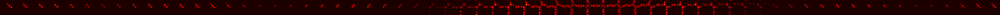
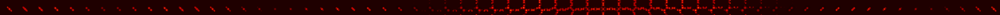

# 3DGAN-for-MOF

Scroll down for English

Данный проект был создан для исследования возможности автоматической генерации металл-органических каркасов (МОК) с заданными адсорбционными свойствами.

В качестве описательного инструмента был выбран энергетический ландшафт, получаемый наложением двухчастичного потенциала Леннарда-Джонса на трёхмерную ячейку моделирования с периодическими граничными условиями.

Адсорбционные свойства оценивались при помощи изотермы Фрейндлиха.

Для создания МОК была написана генеративно-состязательная нейронная сеть (GAN), работающая с объектами в трёхмерном пространстве (3DGAN).

Вы можете самостоятельно сгенерировать энергетический ландшафт при наличии у вас CIF-файла соединения. Для этого воспользуйтесь файлом ./create_dataset/convert_dataset_for_fit.ipynb
В результате у Вас должен получиться энергетический ландшафт, который можно представить в виде .png-файла, похожего на один из примеров:

Для работы с 3DGAN используйте файл из директории ./fit

Этот проект опирается на данные из открытых источников, в частности:
1. The Cambridge Structural Database, C. R. Groom, I. J. Bruno, M. P. Lightfoot and S. C. Ward, Acta Cryst. (2016). B72, 171-179, DOI: 10.1107/S2052520616003954
2. Siderius, D.W., Shen, V.K., Johnson III, R.D. and van Zee, R.D., Eds., NIST/ARPA-E Database of Novel and Emerging Adsorbent Materials, National Institute of Standards and Technology, Gaithersburg MD, 20899, https://dx.doi.org/10.18434/T43882
3. MOFX-DB: An Online Database of Computational Adsorption Data for Nanoporous Materials
N. Scott Bobbitt, Kaihang Shi, Benjamin J. Bucior, Haoyuan Chen, Nathaniel Tracy-Amoroso, Zhao Li, Yangzesheng Sun, Julia H. Merlin, J. Ilja Siepmann, Daniel W. Siderius, and Randall Q. Snurr, Journal of Chemical & Engineering Data 2023 68 (2), 483-498, DOI: 10.1021/acs.jced.2c00583 
4. Anubhav Jain, Shyue Ping Ong, Geoffroy Hautier, Wei Chen, William Davidson Richards, Stephen Dacek, Shreyas Cholia, Dan Gunter, David Skinner, Gerbrand Ceder, and Kristin A. Persson , "Commentary: The Materials Project: A materials genome approach to accelerating materials innovation", APL Materials 1, 011002 (2013) https://doi.org/10.1063/1.4812323

## English

This project was created to study the possibility of automatic generation of metal-organic frameworks (MOFs) with desired adsorption properties.

As a descriptive tool, we chose the energy landscape obtained by superimposing the two-particle Lennard-Jones potential on a three-dimensional simulation cell with periodic boundary conditions.

The adsorption properties were evaluated using the Freundlich isotherm.

To create MOF, a generative adversarial neural network (GAN) was written that works with objects in three-dimensional space (3DGAN).

You can generate an energy landscape yourself if you have a connection CIF file. To do this, use the file ./create_dataset/convert_dataset_for_fit.ipynb
As a result, you should get an energy landscape, which can be represented as a .png file similar to one of the examples:

To work with 3DGAN, use the file from the ./fit directory

This project relies on data from open sources, in particular:

Этот проект опирается на данные из открытых источников, в частности:
1. The Cambridge Structural Database, C. R. Groom, I. J. Bruno, M. P. Lightfoot and S. C. Ward, Acta Cryst. (2016). B72, 171-179, DOI: 10.1107/S2052520616003954
2. Siderius, D.W., Shen, V.K., Johnson III, R.D. and van Zee, R.D., Eds., NIST/ARPA-E Database of Novel and Emerging Adsorbent Materials, National Institute of Standards and Technology, Gaithersburg MD, 20899, https://dx.doi.org/10.18434/T43882
3. MOFX-DB: An Online Database of Computational Adsorption Data for Nanoporous Materials
N. Scott Bobbitt, Kaihang Shi, Benjamin J. Bucior, Haoyuan Chen, Nathaniel Tracy-Amoroso, Zhao Li, Yangzesheng Sun, Julia H. Merlin, J. Ilja Siepmann, Daniel W. Siderius, and Randall Q. Snurr, Journal of Chemical & Engineering Data 2023 68 (2), 483-498, DOI: 10.1021/acs.jced.2c00583 
4. Anubhav Jain, Shyue Ping Ong, Geoffroy Hautier, Wei Chen, William Davidson Richards, Stephen Dacek, Shreyas Cholia, Dan Gunter, David Skinner, Gerbrand Ceder, and Kristin A. Persson , "Commentary: The Materials Project: A materials genome approach to accelerating materials innovation", APL Materials 1, 011002 (2013) https://doi.org/10.1063/1.4812323

# LICENSE

Данная работа распространяется по лицензии Creative Commons Attribution 4.0 International License (CC BY 4.0) https://creativecommons.org/licenses/by/4.0/
This work is licensed under a Creative Commons Attribution 4.0 International License (CC BY 4.0) https://creativecommons.org/licenses/by/4.0/

Данные из датасета, а также полученные энергетические ландшафты распространяются свободно (CC0)
Dataset data and energy landcapes are public domain data (CC0)